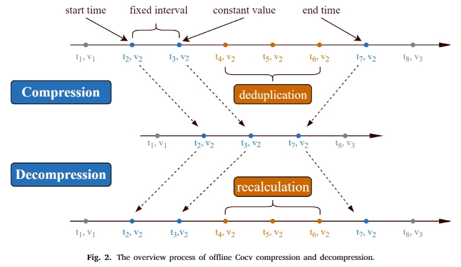
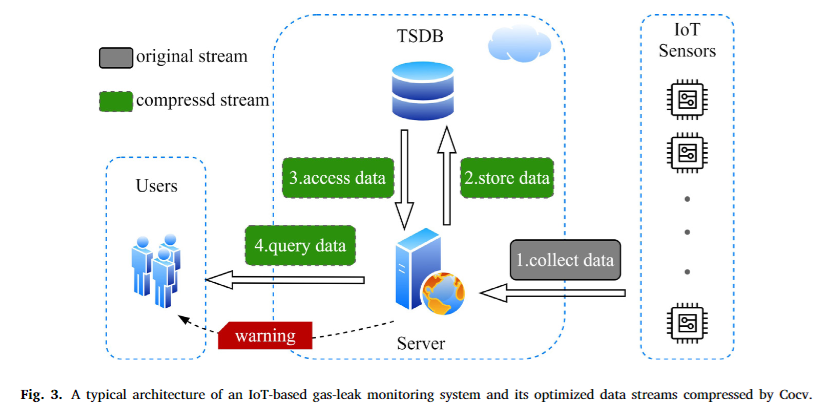

# Cocv
 
Welcome to the official repository of [\[Cocv: A compression algorithm for time-series data with continuous constant values in IoT-based monitoring systems\]](https://www.sciencedirect.com/science/article/pii/S2542660523003724). 
Here, we provide a Python implementation of Cocv for the convenience of readers.

## Introduction
Cocv is a specialized compression algorithm designed for time-series data with continuous constant values in IoT-based monitoring systems.

For instance, in a gas leak monitoring system, the frequency of gas leaks is relatively low, causing the recorded values to often remain constant at 0 for extended periods. 
Similarly, in equipment status monitoring, a device may maintain a constant state (either normal or abnormal) for a considerable duration. 
In such scenarios, the recorded monitoring data contains a significant amount of redundant data points.

To address this, we introduce Cocv, which effectively handles the redundancy of continuous constant values in monitoring data by discarding superfluous redundant points in the data stream, as shown below.


Cocv achieves remarkable compression efficiency in such scenarios. 
Moreover, Cocv can be adapted to an online version to dynamically compress data streams, reducing unnecessary data transmission in IoT systems, thereby decreasing bandwidth consumption and enhancing system throughput.




## Quick Start
We provide a sample Python code for running Cocv. 
You can execute the following command to run a sample of Cocv:

```
python .\Cocv.py
```

**PLEASE NOTE** that Cocv is specifically designed for scenarios such as gas leak monitoring data, which feature continuous, equidistant sampling intervals and a sampling format of (timestamp, value). 
It is not a general-purpose compression algorithm. 

If your goal is to compress more general types of data or more complex data formats, consider other compression algorithms.


## Citation

If you find this repo useful, please cite our paper.
```
@article{lin2024cocv,
  title={Cocv: A compression algorithm for time-series data with continuous constant values in IoT-based monitoring systems},
  author={Lin, Shengsheng and Lin, Weiwei and Wu, Keyi and Wang, Songbo and Xu, Minxian and Wang, James Z},
  journal={Internet of Things},
  volume={25},
  pages={101049},
  year={2024},
  publisher={Elsevier}
}
```